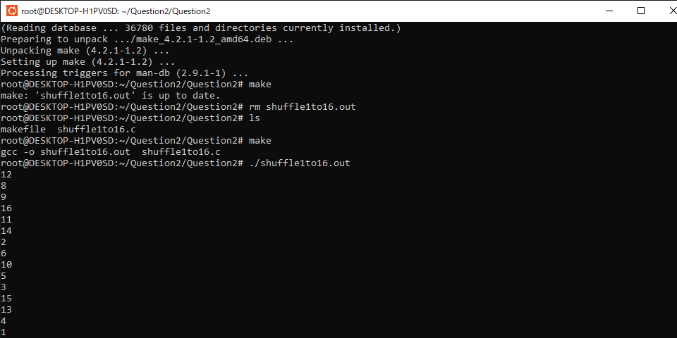
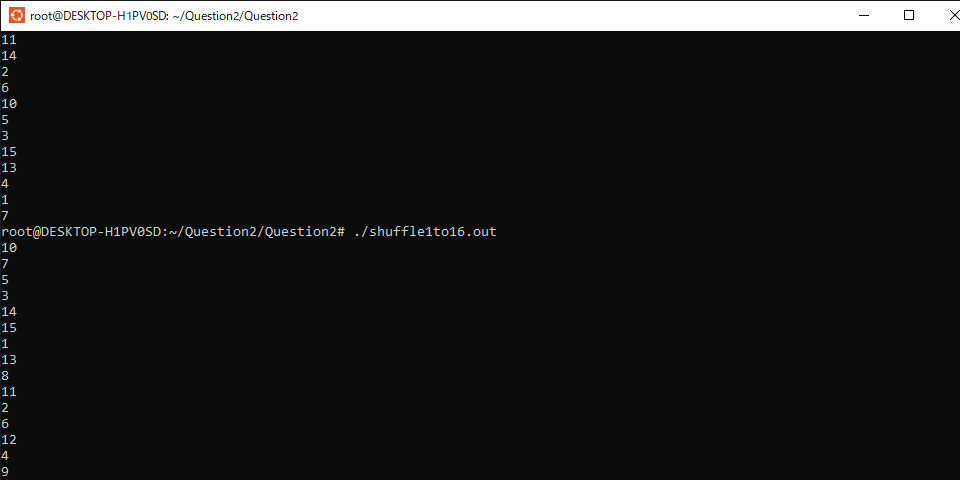

# 問2
## 毎回違う乱数
```
11行目のコードによって、rand関数が時刻によって乱数を生成させるようになる。
```
## 14行目から27行目のfor文
```
まず、18行目でランダムに1-16の整数を生成し、19行目からのfor文で、それよりも前に生成された
整数と被りがないかをチェックしている。16行目からのdo文は、生成された整数に重複がある場合
は抜け出せなくなっている。その場合は、変数iが変わらないままもう一度do文の中身が実行される。
```
[](./imagequestion2/shuffle1.png)
[](./imagequestion2/shuffle2.png)

